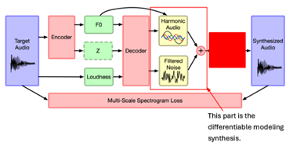

# InterpretSynthMusic
DDSP-Based Neural Audio Synthesis Model with Interpretable Timbre Controls

## What was done?
This project focuses on the development of a neural audio synthesis model that utilizes deep learning to generate audio signals [Oord et al. 2016, Eagle et al. 2018]. We aim to synthesize monophonic audio signals with **interpretable** timbre controls. Timbre can be considered as a multidimensional perceptual attribute that, together with pitch and loudness, affects the **"quality" or "texture"** of a sound. By providing intuitive controls for different aspects of timbre, this model will empower musicians, sound designers, and researchers to manipulate sound in a more nuanced and meaningful way.

## What was the impact?
While existing approaches for neural audio synthesis have produced high-quality results, they often operate in a "black box" manner, **making it difficult to understand how modifications in the latent space translate to specific changes in timbre**. This hinders the creative exploration and precise sound manipulation desired by users. The project addresses this problem by creating a model where modifications in the latent space directly translate to specific timbre changes (such as brightness and sharpness).

**Constraints:** Firstly, the latent space of the model should be capable of representing specific timbre dimensions for further control. Secondly, the model will heavily rely on domain knowledge from digital signal processing (DSP). Lastly, our model aims to handle one specific class of audio signals to improve the quality of the synthesis.

## Report and generated output
- Complete Report available: [here](artifacts/report.pdf)
- Generated outputs available: [here](artifacts/generated_sound)

## Who did it?
- Aayush
- Eto
- Junrui Huang
- Yanting

**Aims/Goals:**

- **Scope:** We aim to develop a deep learning model with interpretable features in the latent space for timbre control based on the differentiable digital signal processing (DDSP) framework and conduct various objective and subjective evaluations to test the performance of our proposed model.

**Constraints:** Our design needs to satisfy the following considerations.

* Interpretable Latent Space 
* Quality of Audio Synthesis should be good.
* Control over Timbre 
* User Experience: A human user should feel that the sound aligns with what they expect for that particular combination of control factors.

**Proposed solution:** Our proposed solution is based on the DDSP framework, which implements the building blocks of DSP models in such a way that they can be integrated into a neural network and the parameters can be back-propagated [Hayes et al. 2024]. Specifically, we will use the differentiable spectral modeling synthesis approach with an autoencoder structure in our model.

**Methodology: referenced paper: (Engel et al. 2020): [ICLR paper link](https://openreview.net/forum?id=B1x1ma4tDr)**

We want to figure out changes to the deep learning elements of the existing architecture to obtain greater control over the individual components of music being generated. Basically, we want to modify the structure of the encoder and decoder so that the latent space contains several interpretable timbre parameters. The loss function will then be changed to reflect both reconstructed audio loss (the spectral loss/spectrogram loss) and the timbre control parameters loss.

**Implementation:** Compared to the original model, we want our encoder to generate a latent vector that contains some parameters related to timbre characteristics (brightness, sharpness, and so on). This may be done by calculating low-level timbre descriptors from the input signal as a part of the latent variables. The fundamental frequency and loudness are needed to generate tones with different pitches and volumes.

**Validation and evaluation:**

* Objective metrics like signal-to-noise ratio (SNR) and ViSQOL will be used to measure the quality of the resynthesis.
* Timbre descriptors of the synthesized signal will be measured and compared with the control parameters in the latent space.
* Subjective experiment: let users tune the timbre parameters and tell if they're smoothly varying along one characteristic of the sound (such as brightness).

**Alternative solutions:**

* Non-deep learning approaches often lack flexibility and control.
* Other deep learning-based methods might not offer interpretable timbre controls.

**Feasibility and Resources**

**Identified datasets which can be used:**

1. NSynth: It contains 305,979 musical notes where each of them has a specific pitch and timbre (Engel et al. 2017), which allows the model to learn timbre from different notes.
2. Amp-Space: It consists of paired audio samples that includes a source audio signal, an output signal, and the result of a timbre transformation (Naradowsky 2021), which can be used for the model to learn the timbre transformation, as well as for the validation for the model. 
3. Synth1B1: It contains 1 billion 4-second synthesized sounds paired with the synthesis parameters used to generate them (Turian et al. 2021), which can be used in the training for synthesizing individual notes with desired timbre into a complete melody.

**Computing resources:** A computing cluster in the Digital Research Alliance of Canada can be used to train the proposed model. Backup resources: TPU research cloud.

**Risk Analysis**

* Data Limitations: Even though the aforementioned datasets contain timbre data with great diversity, it is still possible that some specific timbre variations are missing. To resolve this issue, data augmentation techniques can be applied to generate more timbre data with unseen characteristics.

* Interpretability Challenges: It is challenging to extract meaningful embeddings from our latent space and realize their exact impact on the synthesized signal. We will experiment with different loss functions and encoder-decoder structures to make the connection between latent space and the resulting impact on the audio signal more robust.

* Performance Limitations: It is crucial but difficult for our model to gain effective timbre control while keeping good sound quality. To achieve this goal, we can apply different techniques, for example, hyperparameter tuning, to try to achieve the balance between timbre control and sound quality while maintaining computational efficiency. 

### 
**References and resources:**

### 
**Papers and Tutorials**

* A very good DDSP tutorial: [Introduction to DDSP for Audio Synthesis](https://intro2ddsp.github.io/intro.html)
* The original DDSP paper (Engel et al. 2020): [ICLR paper link](https://openreview.net/forum?id=B1x1ma4tDr)
* A detailed review of DDSP in music and speech synthesis (Hayes et al. 2024): [arXiv link](https://arxiv.org/abs/2308.15422), [frontiers link](https://www.frontiersin.org/articles/10.3389/frsip.2023.1284100/full)
* A paper about drum synthesis using high-level timbre descriptors (brightness, depth, warmth) for control the synthesis (Lavault et al. 2022): [paper link](https://www.dafx.de/paper-archive/2022/papers/DAFx20in22_paper_20.pdf)
* A paper about find the synthesizer parameters from an input audio signal (Masuda & Saito 2021): [paper link](https://archives.ismir.net/ismir2021/paper/000053.pdf)
* A paper about piano synthesis by incorporating physical knowledge about the piano to the neural network design: [paper link](https://www.aes.org/e-lib/browse.cfm?elib=22231)
* A paper about transfering the styles of audio effects from one recording to another (Steinmetz et al. 2022): [paper link](https://arxiv.org/abs/2207.08759)
    * a 44-minutes presentation video: [YouTube link](https://www.youtube.com/watch?v=-ezTdjRpAvw)
* Spectral modeling synthesis is a DSP model that considers the sound as a combination of sinusoids and filtered noise and synthesizes the sound with given parameters such as partial frequency, amplitude, and filter coefficients [Serra and Smith 1990].

### 
**Applications and Demos**

* Audio examples of the original DDSP paper: [supplement link](https://storage.googleapis.com/ddsp/index.html)
* Another demo site about applying the original DDSP architecture directly for timbre transfer: [Tone Transfer](https://sites.research.google/tonetransfer)
* Examples of another architecture for neural synthesis: [audio examples](https://anonymous84654.github.io/RAVE_anonymous/)
    * high reconstruct quality and real-time ability by adding a GAN structure (Caillon & Esling 2021) [paper link](https://arxiv.org/abs/2111.05011)
* Sound examples for finding the synthesizer parameters and re-synthesis of the sounds: [GitHub link](https://nas-fm.github.io/)
    * (Ye et al. 2023) [paper link](https://arxiv.org/abs/2305.12868)
* Sound examples for DDSP-Piano: [supplement link](http://renault.gitlab-pages.ircam.fr/dafx22-audio/jekyll/update/2022/04/25/supplementary-materials)
* Sound examples for "style transfer of audio effects" paper: [GitHub link](https://csteinmetz1.github.io/DeepAFx-ST/)

### 
**Datasets**

* NSynth (Engel et al. 2017): [website](https://magenta.tensorflow.org/datasets/nsynth)
    * containing 305,979 musical notes
    * contains source, instrument family, qualities, pitch, and velocity
    * only 16kHz
* Amp-Space (Naradowsky 2021): [paper link](https://dafx2020.mdw.ac.at/proceedings/papers/DAFx20in21_paper_47.pdf)
    * large-scale dataset of paired audio samples
    * a source audio signal, and an output signal, the result of a timbre transformation
    * >500 hours synthesized audio + >50 hours real audio
    * 44.1kHz monaural sound
* synth1B1 (Turian et al. 2021): [paper link](https://www.dafx.de/paper-archive/2021/proceedings/papers/DAFx20in21_paper_34.pdf)
    * 1 billion 4-second synthesized sounds
    * paired with the synthesis parameters used to generate them
    * 44.1kHz

\
Referring to the autoencoder architecture from DDSP paper by Engel et al. 2020, \

Note: The components with a yellow background mean that they use digital signal processing (DSP) models instead of neural networks, so these components don't need to be trained. They need parameters like frequencies and amplitudes as inputs of each wave at each time.